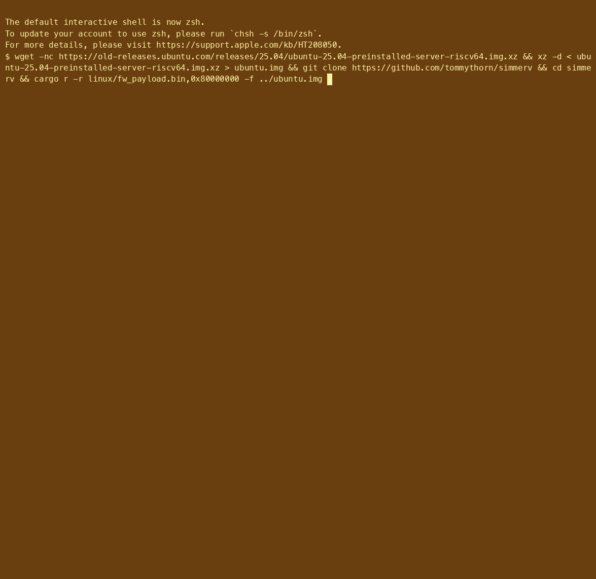

[](https://github.com/tommythorn/simmerv/actions/workflows/rust.yml)

# Simmerv

Simmerv is a [RISC-V](https://riscv.org/) SoC emulator written in Rust
and compilable to WebAssembly.  It began as a fork of [Takahiro's
riscv-rust emulator](https://github.com/takahirox/riscv-rust), but has
by now been extensively rewritten, making it far more complete and
much faster.  Ultimately, we expect it to become substantially faster,
but this work is delayed until we are able to run standard benchmarks
and off-the-shelf Linux distributions.

## Online Demo

You can run Linux on the emulator in your browser: [online demo is
here](https://tommythorn.github.io/simmerv/)

## Booting Ubuntu on Simmerv (sped up 50 X)



## Features

- Emulates RISC-V `RV64GC_Zba_Zbb_Zbc_Zbs_Zicond_Zfhmin_Svinval_Svade_Svpbmt_Sstc_Zicbom_Zicbop_Zicboz_Zihpm` (RVA22) processor and peripheral devices
  (CLINT, PLIC, NS16550A UART, virtio block device, and VirtIO ethernet)
- Optional RVA23 mode, enabled with `--rva23`: the `V` vector extension
  (RVV 1.0, `VLEN`=128, `ELEN`=64) plus Zcb, Zimop, Zcmop, Zfa, Zawrs, Zacas,
  Zabha, Zvbb and Zvkt.  Boots the RVA23 port of Ubuntu 26.04.
- Targets native and WASM
- Snapshots
- Speedometer

## Instructions/Features support status

### RVA22 profile (complete)

- [x] RV64IMAC
- [x] RV64FD
- [x] RV64Zifencei
- [x] RV64Zicsr
- [x] Zba, Zbb, Zbc, Zbs ("B" extension)
- [x] Zicond
- [x] Zfhmin (half-precision float conversions)
- [x] Zihpm (hardware performance counters)
- [x] Zicbom, Zicbop, Zicboz (cache block operations)
- [x] Svinval (fine-grained TLB invalidation)
- [x] Svade (hardware A/D fault-on-access)
- [x] Sstc (stimecmp/menvcfg timer compare)
- [x] Sv39, Sv48, Sv57
- [x] Svpbmt (page-based memory types; PTEs accepted, no caches to model)
- [x] Privileged Spec 1.12 (mcounteren/scounteren, senvcfg, PMP stub with 0 entries)
- [x] Svnapot
- [-] PMP enforcement (0 entries implemented; all accesses permitted)

The emulator supports all instructions listed above.

- Passes all riscof (RISC-V Architectural Tests) for RV64IMC
- Boots Buildroot, Debian Trixie, Ubuntu
- Linux OpenSBI and legacy BBL boot support

### RVA23 profile (in progress)

- [x] **V** — the vector extension, RVV 1.0.  All of `Zve64d` plus the full
      `V` instruction set: configuration, unit-stride / strided / indexed /
      segment / whole-register / fault-only-first loads and stores, the
      integer, fixed-point, mask, permutation and floating-point operations,
      and the `vstart` / `vl` / `vtype` / `vxrm` / `vxsat` / `vcsr` / `vlenb`
      CSRs with `mstatus.VS`.  `VLEN` is 128 (`Zvl128b`, the profile minimum).
- [x] Zvfh, Zvfhmin — vector half-precision (the full arithmetic set, which is
      a superset of the `Zvfhmin` the profile requires)
- [x] Zvkt, Zkt — constant-time execution; trivially satisfied by a functional
      model with no data-dependent timing
- [x] Zicond, Zfhmin, Zicbom/z/p, Svinval, Svnapot, Svpbmt, Sstc, Svade
      (inherited from RVA22)
- [x] Zcb — the newer compressed encodings.  Each one abbreviates an
      instruction the emulator already had, so all twelve decode straight to
      that uop rather than to a parallel execution path.
- [x] Zimop, Zcmop — may-be-operations.  `mop.r.n` / `mop.rr.n` write zero to
      `rd`; `c.mop.n` changes no architectural state at all.
- [x] Zfa — `fli` (both constant tables), `fminm`/`fmaxm`, the quiet compares
      `fleq`/`fltq`, `fround`/`froundnx` and `fcvtmod.w.d`.  The
      half-precision members are omitted: they need full `Zfh`, which RVA23
      does not mandate and this emulator does not implement.
- [x] Zvbb — vector basic bit manipulation (`vandn`, `vbrev`, `vbrev8`,
      `vrev8`, `vclz`, `vctz`, `vcpop`, `vrol`, `vror`, `vwsll`), and with it
      `Zvkb`, which is a strict subset
- [x] Zawrs — wait-on-reservation-set.  Both forms may terminate the wait
      immediately and for any reason, so both retire as no-ops.
- [x] Zacas — `amocas.b/h/w/d/q`, including the quadword form over even/odd
      register pairs
- [x] Zabha — byte and halfword forms of every AMO
- [ ] Zihintntl — non-temporal locality hints
- [ ] Supm / Ssnpm / Smnpm — pointer masking
- [ ] Sscofpmf — count-overflow interrupts (the CSR reads exist, no overflows
      are raised)
- [ ] Ssstateen / Smstateen — the state-enable CSRs
- [ ] H — the hypervisor extension, required by RVA23S64
- [ ] Sv48, Sv57 in `satp` (the page-table walker handles them, but `satp`
      writes currently accept only Bare and Sv39)

`V`, Zcb, Zimop, Zcmop, Zfa, Zvbb, Zawrs, Zacas and Zabha are off by default and
enabled together by `--rva23`, so that a run without the flag still models a hart
that traps every one of those encodings.  (The entries inherited from RVA22 are
always on.)  RVA23 mandates `V`, so one switch covers the lot: it gates
instruction decoding, the `misa` `V` bit and the vector CSRs, and swaps in a
device tree whose cpu node advertises the profile.

```sh
$ cargo r -r -- --rva23 -n my-vector-program.elf
```

To boot the RVA23 port of Ubuntu, the guest kernel must also have been built
with `CONFIG_RISCV_ISA_V=y` — without it the kernel drops `v` from the ISA it
parses out of the device tree, and an RVA23 userland dies on the first vector
instruction in `ld.so`, because the profile lets glibc emit vector code with no
scalar fallback.  `riscv: base ISA extensions` in the boot log is the thing to
check: it should read `acdfimv`.

```sh
$ cargo r -r -- --rva23 -f ubuntu-26.04-preinstalled-server-riscv64.img \
      fw_payload.bin,0x80000000
```

`tests/vector/run.sh` builds a bare-metal exerciser — 1994 instruction cases
across every SEW, LMUL, rounding mode and addressing form, covering the RVA23
additions as well as base RVV — and diffs simmerv's transcript against QEMU's
`virt` machine, which shares simmerv's memory map.  All 1994 transcript lines
currently match exactly, with three traps on both sides: `vwsll` at `SEW`=64,
where the widened element exceeds `ELEN` and the encoding must be illegal.

One deliberate difference: simmerv enforces `vill`, register-group alignment,
EMUL range and the "masked instruction may not write v0" rule, but not the
finer source/destination overlap constraints (a narrowing `vs1` inside the
double-width `vs2` group, a segment-load destination overlapping the index
group).  QEMU raises an illegal instruction for those; simmerv executes them.
No conforming assembler emits them.

## How to run Linux with VirtIO Block Device (/dev/vda)

*VERY IMPORTANT: images are stored with git LFS*. Install LFS (don't
forget `git lfs install` also) and recheckout if needed.  Otherwise
the images will be small files with LFS pointers.

```sh
$ cargo r -r -- linux/fw_payload.bin,0x80000000 -f linux/rootfs.img
```

or
```sh
$ cargo r -r -- -c linux/opensbi/fw_jump.elf,0x80000000 linux/vmlinux,0x80200000 -f linux/rootfs.img
```

## How to run Linux with initramfs (/dev/ram)

Allocate 2 GiB, use a device tree with initramfs at 0xa0000000 and
load the initrd2+gdb.cpio binary at that address.

```sh
$ (cd linux;cargo r -r -- -m 2048 -d with-initrd.dtb fw_payload.bin,0x80000000 initrd2+gdb.cpio,0xa0000000)
```

## How to set up networking (VirtIO-net)

Simmerv emulates a VirtIO-net device (MAC `52:54:00:12:34:56`) on the second
virtio-mmio window. The built-in device tree already declares it, so a guest
kernel with `CONFIG_VIRTIO_NET` probes it automatically — but the device stays
inert (packets are dropped) until you attach a host backend. There is no
built-in emulator NAT/DHCP other than what the backend provides.

### Linux: TAP interface (`-T`)

On Linux, Simmerv connects the guest's NIC to a **TAP** device — a raw
layer-2 link with no DHCP or NAT of its own, so you configure the host side
and give the guest a static address (or bridge `tap0` into a real network if
you prefer).

1. Create a persistent TAP owned by your user (so Simmerv needs no root):

```sh
$ sudo ip tuntap add dev tap0 mode tap user $USER
$ sudo ip link set tap0 up
$ sudo ip addr add 172.16.0.1/24 dev tap0
```

2. *For guest internet access*, enable forwarding + NAT on the host. The
   MASQUERADE rule must name your **internet-facing** interface — auto-detect
   it from the default route rather than assuming `eth0`:

```sh
$ UPLINK=$(ip route show default | awk '{print $5; exit}')   # e.g. enp9s0, wlan0
$ echo "NAT via uplink: $UPLINK"                              # sanity-check it
$ sudo sysctl -w net.ipv4.ip_forward=1
$ sudo iptables -t nat -A POSTROUTING -s 172.16.0.0/24 -o "$UPLINK" -j MASQUERADE
$ sudo iptables -A FORWARD -i tap0 -j ACCEPT
$ sudo iptables -A FORWARD -o tap0 -m state --state RELATED,ESTABLISHED -j ACCEPT
```

   If the guest reaches the host (`172.16.0.1`) but nothing beyond it, this
   rule is almost always the culprit — check it with
   `sudo iptables -t nat -L POSTROUTING -n -v` (wrong `out` interface, or a
   `pkts` count stuck at 0 while the guest generates traffic).

3. Run Simmerv attached to the TAP (`-T <ifname>`):

```sh
$ cargo r -r -- -T tap0 linux/fw_payload.bin,0x80000000 -f linux/rootfs.img
```

4. Configure the interface inside the guest (the name may be `eth0`,
   `enp0s…`, etc. — check `ip link`):

```sh
# in the guest
$ ip addr add 172.16.0.2/24 dev eth0
$ ip link set eth0 up
$ ip route add default via 172.16.0.1        # only needed for step 2
$ echo 'nameserver 1.1.1.1' > /etc/resolv.conf
```

Host (`172.16.0.1`) and guest (`172.16.0.2`) can now ping each other; with
step 2 the guest also reaches the internet. Remove the TAP afterwards with
`sudo ip tuntap del dev tap0 mode tap`.

### macOS: vmnet shared/NAT (`--vmnet`)

On macOS, Simmerv uses Apple's `vmnet.framework` in **shared mode**, which
supplies DHCP *and* NAT automatically — the guest just needs to request an
address. `vmnet` shared mode requires elevated privileges, so run under
`sudo`. Build first so `sudo` doesn't rebuild the tree as root:

```sh
$ cargo build -r
$ sudo ./target/release/simmerv_cli --vmnet linux/fw_payload.bin,0x80000000 -f linux/rootfs.img
```

The guest receives an address on vmnet's subnet (typically `192.168.x.x`) with
NAT to the host's network. If your guest image doesn't bring the link up
automatically, run a DHCP client inside it:

```sh
# in the guest
$ udhcpc -i eth0        # busybox; or: dhclient eth0
```

(`-T`/`--tap` is Linux-only and `--vmnet` is macOS-only; each errors out on the
other platform.)

## How to run riscv-tests

```sh
$ ./run-riscv-tests.sh
```

## How to import and use WebAssembly RISC-V emulator in a web browser

See [wasm/web](https://github.com/tommythorn/simmerv/tree/master/wasm/web)

## How to install and use WebAssembly RISC-V emulator npm package

See [wasm/npm](https://github.com/tommythorn/simmerv/tree/master/wasm/npm)

## Links

### Linux RISC-V port

[Running 64-bit RISC-V Linux on QEMU](https://risc-v-getting-started-guide.readthedocs.io/en/latest/linux-qemu.html)

### Specifications

- [RISC-V ISA](https://riscv.org/specifications/)
- [Virtio Device](https://docs.oasis-open.org/virtio/virtio/v1.1/csprd01/virtio-v1.1-csprd01.html)
- [UART](http://www.ti.com/lit/ug/sprugp1/sprugp1.pdf)
- [CLINT, PLIC (SiFive E31 Manual)](https://sifive.cdn.prismic.io/sifive%2Fc89f6e5a-cf9e-44c3-a3db-04420702dcc1_sifive+e31+manual+v19.08.pdf)
- [SiFive Interrupt Cookbook](https://sifive.cdn.prismic.io/sifive/0d163928-2128-42be-a75a-464df65e04e0_sifive-interrupt-cookbook.pdf)
